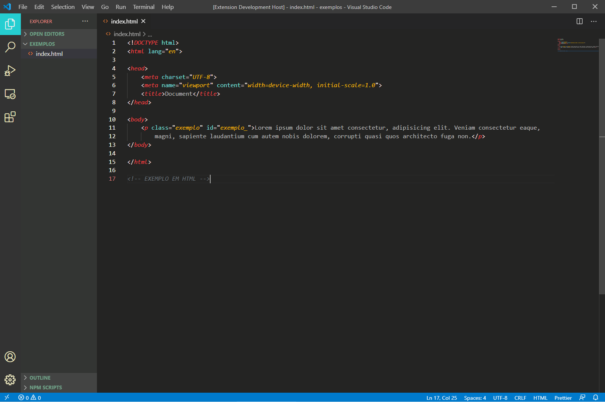
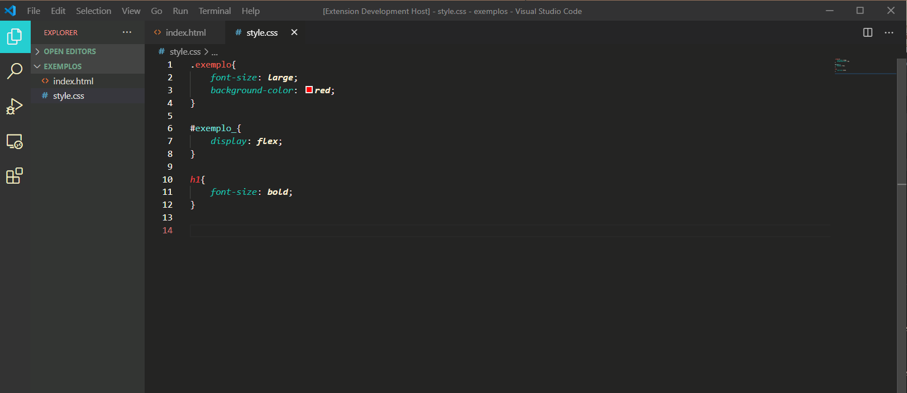
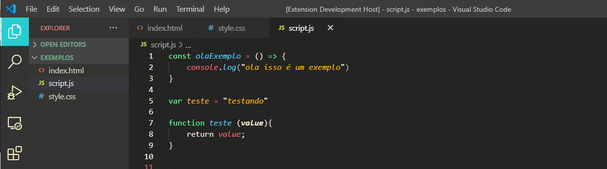

# VSCode Theme: miojolu-theme-2021
Essa extensão foi um projeto de aprendizado sobre o editor VSCode.

Screenshots
---

### HTML

### CSS

### JavaScript

Installation | Instalação | Instalación
---
VSCode -> Extensions -> 'miojolu-theme-2021'

[VSCode Marketplace](https://marketplace.visualstudio.com/items?itemName=LuizaParente.miojolu)
